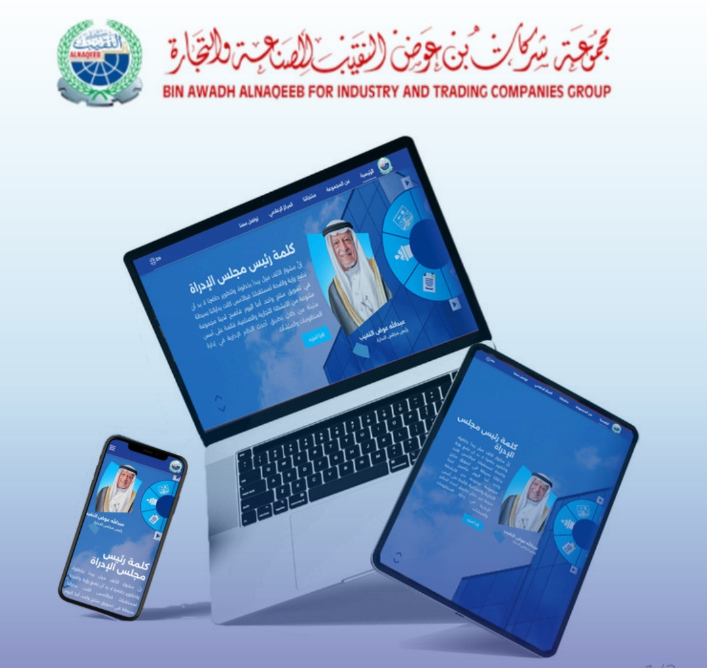

# Al-Naqeeb

Professional corporate platform delivered as a full-stack web product for a client through Becon Agency.

## Overview
Al-Naqeeb is a multi-page corporate platform built to present company information in a polished, scalable, and search-friendly way. The project combines a modern frontend experience with a custom backend and content management workflow to keep the site easy to maintain after launch.

## My Role
- Full-Stack Developer
- Worked through: Becon Agency
- Responsibility: Frontend, backend, dashboard workflow, deployment, and production delivery

## Tech Stack
- Next.js
- SCSS
- Node.js
- Express.js
- MySQL

## Key Features
- Multi-page architecture for structured content presentation
- Custom dashboard for content management
- Dynamic and editable website sections
- SEO-focused implementation
- VPS deployment and production setup

## Live Project
- Website: https://www.alnaqeeb.com/

## Project Status
- Source code is not publicly available
- This repository is published as a project showcase and portfolio reference

## Notes
This project was developed for a client through an agency, so the public repository is intentionally limited to documentation only.
